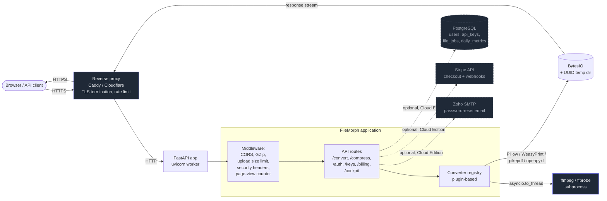

# Architecture

This document is a one-page overview of how a FileMorph deployment is wired,
intended for procurement reviewers, security teams, and self-hosters who
need to know what runs where before approving a deployment. For the deeper
control-by-control description see
[`security-overview.md`](./security-overview.md); for data-flow specifics
see [`gdpr-privacy-analysis.md`](./gdpr-privacy-analysis.md).

## Component map

## Request lifecycle

Every conversion or compression request follows the same path:

1. **TLS termination** at the reverse proxy (Caddy in self-hosted, Cloudflare
   plus Caddy in the SaaS deployment). The application itself never receives
   raw TCP.
2. **CORS + security headers** middleware (`app/main.py`). Sets
   `X-Content-Type-Options`, `X-Frame-Options`, a strict CSP whose
   `connect-src` is derived from the configured `API_BASE_URL`, and a
   `Referrer-Policy` of `strict-origin-when-cross-origin`.
3. **Upload-size guard** rejects any POST with a `Content-Length` above
   `MAX_UPLOAD_SIZE_MB` (default 2000) before the body is read.
4. **Authentication.** API requests go through `validate_api_key()` in
   `app/core/security.py` — a SHA-256 + `hmac.compare_digest` constant-time
   check against the `api_keys.json` file (Community Edition) or the
   `api_keys` table (Cloud Edition). Web-UI flows use JWT cookies issued by
   the auth router.
5. **Rate limiting** via `slowapi` — 10 requests per minute per IP for the
   convert and compress endpoints; the limiter state is in-memory and
   resets on restart.
6. **Magic-byte check** before any conversion runs — uploads matching the
   PE, ELF, shell-script, or PHP prefixes are rejected with HTTP 415.
7. **Converter dispatch** through the plugin registry
   (`app/converters/registry.py`). Each plugin runs in `asyncio.to_thread`
   so that synchronous C bindings (Pillow saves, WeasyPrint, pikepdf,
   ffmpeg subprocess) do not block the event loop.
8. **Output stream + temp cleanup.** Converted bytes are returned via a
   streaming response. Any UUID-named scratch path created during the
   conversion is removed in the request's `finally` block; on app start a
   sweep deletes any `fm_*` temp dir older than ten minutes.

## What lives where

| Concern | Location |
|---|---|
| HTTP entry point | `app/main.py` |
| Middleware (CORS, GZip, security headers, upload limit, page-view counter) | `app/main.py` |
| API routes | `app/api/routes/` |
| Auth (API key validation, JWT issue/verify) | `app/core/security.py`, `app/core/auth.py`, `app/api/routes/auth.py` |
| Converter plugins | `app/converters/` |
| ORM models (Cloud Edition) | `app/db/models.py` |
| Migrations | `alembic/versions/` |
| Configuration | `app/core/config.py` (env-var driven; `.env` for local dev) |

## Deployment shape

A typical deployment is a single FastAPI process behind a reverse proxy.
The container image is published to GHCR and bundles ffmpeg and the
converter dependencies; the proxy is the operator's choice (Caddy is the
documented default — see [`self-hosting.md`](./self-hosting.md)).

For PostgreSQL, ffmpeg, and the SMTP relay the application opens outbound
connections only when the corresponding feature is in use; a deployment
that runs without accounts (Community Edition self-host) needs none of
these. The dashed boxes in the diagram above mark these optional
attachments.

## Statelessness and horizontal scaling

The application keeps no per-request state on disk beyond the transient
temp directory described above. A horizontally scaled deployment is
possible today, with two caveats:

- The `slowapi` rate limiter uses in-memory storage, so each replica
  enforces its own quota. For a single-tenant compliance deployment this
  is usually adequate; multi-replica SaaS deployments should swap in a
  Redis backend.
- The `daily_metrics` counters use Postgres-side `ON CONFLICT` UPSERTs
  with a per-call session, so concurrent writers are race-free.

## See also

- [`self-hosting.md`](./self-hosting.md) — runtime configuration, env-vars,
  reverse-proxy examples.
- [`security-overview.md`](./security-overview.md) — control-by-control
  description plus the threat model.
- [`gdpr-privacy-analysis.md`](./gdpr-privacy-analysis.md) — data flow and
  retention semantics.
- [`sub-processors.md`](./sub-processors.md) — third-party services a
  deployment may touch.
