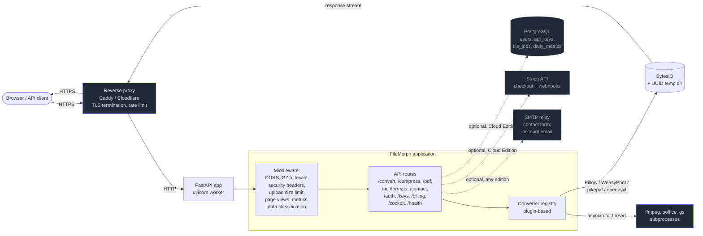

# Architecture

This document is a one-page overview of how a FileMorph deployment is wired,
intended for procurement reviewers, security teams, and self-hosters who
need to know what runs where before approving a deployment. For the deeper
control-by-control description see
[`security-overview.md`](./security-overview.md); for data-flow specifics
see [`gdpr-privacy-analysis.md`](./gdpr-privacy-analysis.md).

## Component map

```mermaid
flowchart LR
    User([Browser / API client]) -->|HTTPS| Proxy[Reverse proxy<br/>Caddy / Cloudflare<br/>TLS termination, rate limit]
    Proxy -->|HTTP| App[FastAPI app<br/>uvicorn worker]

    subgraph App_Internal[FileMorph application]
        Mw[Middleware:<br/>CORS, GZip, locale,<br/>security headers,<br/>upload size limit,<br/>page views, metrics,<br/>data classification]
        Routes[API routes<br/>/convert, /compress, /pdf,<br/>/ai, /formats, /contact,<br/>/auth, /keys, /billing,<br/>/cockpit, /health]
        Conv[Converter registry<br/>plugin-based]
        Mw --> Routes --> Conv
    end

    App --> Mw
    Conv -->|Pillow / WeasyPrint /<br/>pikepdf / openpyxl| InMemory[(BytesIO<br/>+ UUID temp dir)]
    Conv -->|asyncio.to_thread| FFmpeg[ffmpeg, soffice, gs<br/>subprocesses]

    Routes -.->|optional, Cloud Edition| DB[(PostgreSQL<br/>users, api_keys,<br/>file_jobs, daily_metrics)]
    Routes -.->|optional, Cloud Edition| Stripe[Stripe API<br/>checkout + webhooks]
    Routes -.->|optional, any edition| SMTP[SMTP relay<br/>contact form,<br/>account email]

    InMemory -->|response stream| Proxy
    Proxy -->|HTTPS| User

    classDef ext fill:#1f2937,stroke:#6366f1,color:#e5e7eb
    classDef opt fill:#1f2937,stroke:#374151,color:#9ca3af,stroke-dasharray: 4 2
    class Stripe,SMTP,DB opt
    class Proxy,FFmpeg ext
```

## Request lifecycle

Every conversion or compression request follows the same path:

1. **TLS termination** at the reverse proxy (Caddy in self-hosted, Cloudflare
   plus Caddy in the SaaS deployment). The application itself never receives
   raw TCP.
2. **Middleware** (`app/main.py`):
   - **security headers** — sets `X-Content-Type-Options`,
     `X-Frame-Options`, a strict CSP whose `connect-src` is derived from the
     configured `API_BASE_URL`, a `Referrer-Policy` of
     `strict-origin-when-cross-origin`, a `Permissions-Policy`, and HSTS on
     HTTPS;
   - CORS and GZip;
   - **upload-size guard** — rejects any POST with a `Content-Length` above
     `MAX_UPLOAD_SIZE_MB` (default 100) before the body is read;
   - locale resolver (from the URL prefix, no cookie);
   - data classification — reads `X-Data-Classification` and echoes it on
     the response;
   - page-view counter, and request metrics (`app/core/observability.py`;
     only with `METRICS_ENABLED`, the default).
3. **Authentication**, as route dependencies — optional on the conversion
   routes: a request without credentials runs on the anonymous tier. An
   `X-API-Key` header, if sent, is checked by `require_api_key`
   (`app/api/deps.py`): it is accepted if it is in the `api_keys.json` file
   (keys made with `scripts/generate_api_key.py`; `validate_api_key()`, a
   SHA-256 + `hmac.compare_digest` constant-time check) or is an active key
   in the `api_keys` table (keys created in the dashboard, Cloud Edition;
   `find_active_api_key()`, a lookup by SHA-256 hash). Both live in
   `app/core/security.py`. Any other key gets `401`, and `429` once the IP
   has sent 30 rejected keys in a minute. Web-UI flows
   use JWT bearer tokens issued by the auth router and carried in the
   `Authorization: Bearer` header; the browser keeps them in `localStorage`,
   not a cookie — FileMorph sets **no cookies** (see `privacy.html` §6).
   `get_optional_user` (`app/api/routes/auth.py`) resolves a bearer token or
   a dashboard key to the account whose tier limits apply; a key from the
   key file runs on `API_KEYS_FILE_TIER` (default: anonymous), and
   `caller_tier()` in `app/api/deps.py` makes that choice.
4. **Rate limiting** via `slowapi`, checked after the dependencies — 10
   requests per minute per IP for the convert and compress endpoints (every
   limit: [`api-reference.md`](./api-reference.md#rate-limiting)); the
   limiter state is in-memory and resets on restart.
5. **Magic-byte check** before any conversion runs — uploads matching the
   PE, ELF, shell-script, or PHP prefixes are rejected with HTTP 400
   (`"File type not permitted."`; in a batch, only that file fails).
6. **Converter dispatch** through the plugin registry
   (`app/converters/registry.py`). Each plugin runs in `asyncio.to_thread`
   so that synchronous C bindings (Pillow saves, WeasyPrint, pikepdf) and
   the external programs — ffmpeg, LibreOffice (`soffice`, office image
   only) and Ghostscript (`gs`, PDF/A) — do not block the event loop. Each
   external program runs under a time limit: ffmpeg
   `MEDIA_SUBPROCESS_TIMEOUT_SECONDS` (default 600 s), LibreOffice
   `OFFICE_SUBPROCESS_TIMEOUT_SECONDS` (default 60 s), Ghostscript 60 s.
7. **Output stream + temp cleanup.** Converted bytes are returned via a
   streaming response. Any UUID-named scratch path created during the
   conversion is removed in the request's `finally` block; on app start a
   sweep deletes any `fm_*` temp dir older than ten minutes.

## What lives where

| Concern | Location |
|---|---|
| HTTP entry point | `app/main.py` |
| Middleware (data classification, upload limit, page-view counter, security headers, locale, GZip, CORS) | `app/main.py`; request metrics in `app/core/observability.py` |
| API routes | `app/api/routes/` |
| Auth (API-key check, JWT issue/verify, password hashing) | `app/api/deps.py`, `app/core/security.py`, `app/core/tokens.py`, `app/core/auth.py`, `app/api/routes/auth.py` |
| Converter plugins | `app/converters/` |
| ORM models (Cloud Edition) | `app/db/models.py` |
| Migrations | `alembic/versions/` |
| Configuration | `app/core/config.py` (env-var driven; `.env` for local dev) |

## Deployment shape

A typical deployment is a single FastAPI process behind a reverse proxy.
The container image is published to GHCR and bundles ffmpeg and the
converter dependencies; the proxy is the operator's choice (Caddy is the
documented default — see [`self-hosting.md`](./self-hosting.md)).

PostgreSQL and Stripe belong to the Cloud Edition: the application
connects to PostgreSQL only when `DATABASE_URL` is set and to Stripe only
when `STRIPE_SECRET_KEY` is set, and a deployment without accounts
(Community Edition self-host) needs neither. The SMTP relay is optional on
every edition — it sends the contact form (`POST /api/v1/contact`) and,
with accounts, the account emails — and is used only when `SMTP_HOST` is
set. The dashed boxes in the
diagram above mark these optional attachments. ffmpeg is not one of them:
it is a local program, bundled in the container image, that audio and
video conversion need on every edition.

## Statelessness and horizontal scaling

The application keeps no per-request state on disk beyond the transient
temp directory described above. A horizontally scaled deployment is
possible today, with two caveats:

- The `slowapi` rate limiter uses in-memory storage, so each replica
  enforces its own quota. For a single-tenant compliance deployment this
  is usually adequate; multi-replica SaaS deployments should swap in a
  Redis backend.
- The `daily_metrics` counters use Postgres-side `ON CONFLICT` UPSERTs
  with a per-call session, so concurrent writers are race-free.

## See also

- [`self-hosting.md`](./self-hosting.md) — runtime configuration, env-vars,
  reverse-proxy examples.
- [`security-overview.md`](./security-overview.md) — control-by-control
  description plus the threat model.
- [`gdpr-privacy-analysis.md`](./gdpr-privacy-analysis.md) — data flow and
  retention semantics.
- [`sub-processors.md`](./sub-processors.md) — third-party services a
  deployment may touch.
